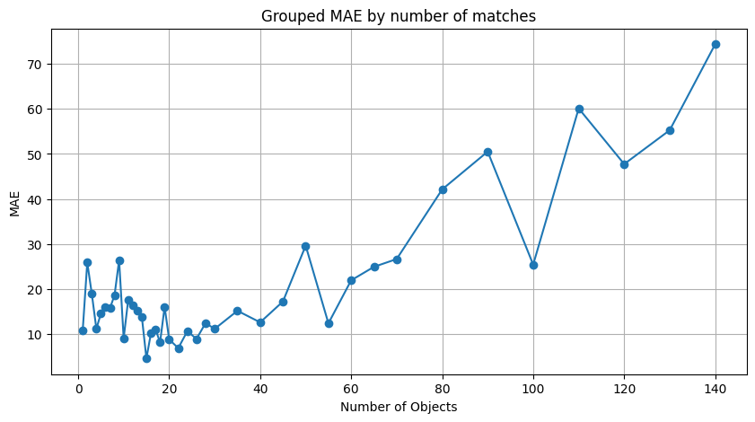

## Caixinha:

**Task**: 
Shake a box filled with identical objects (e.g., matchsticks, balls, etc.), and determine a method to count the number of objects inside using only the sound produced by shaking the box.

**Key Objectives**:
- Relate the sound intensity with the system’s entropy and the number of objects.
- Relate the collision frequency, sound intensity, packing density, and the properties of both the objects and the box to the precision of the method.
  
Additionally, since the goal is to train a model to predict the number of objects based on sound, I hypothesize that **as sound intensity decreases due to packing effects, the model’s accuracy will also drop**. This connection between physical phenomena and the model’s performance will be explored throughout.

---

## 1. Introduction

When a box filled with identical objects is shaken, the sounds produced come from collisions. These collisions can be classified as:
1. **Between objects**: When two objects inside the box collide.
2. **Between objects and the walls**: When an object inside the box collides with one of the walls.

The challenge lies in analyzing these collisions and sounds to determine the number of objects present inside the box. **However, it is expected that as the sound intensity decreases due to overpacking, the ability of the model to accurately predict the number of objects will also reduce**. This will directly impact the model’s accuracy.

---

## 2. Theoretical Analysis

### Entropy and Microstates

Entropy is a measure of the disorder in a system, and in this case, it helps describe how the energy and states of the objects inside the box are distributed. To understand how entropy influences the system, we first need to define **microstates**.

A **microstate** refers to a specific configuration of positions and momenta of the objects inside the box. For example, when objects move, collide, and transfer energy, the number of ways this can happen is directly linked to the system’s entropy.

#### Steps to Calculate Entropy:

1. **Number of Microstates (\( \Omega \))**:
   The total number of microstates \( \Omega \) in a system can be described as:
   \[
   \Omega = \text{number of possible configurations (positions and momenta)}
   \]
   For each object in the box, it can occupy a different position and have a different momentum. For **n objects**, the total number of microstates grows exponentially as the system becomes more complex.

2. **Phase Space Representation**:
   The behavior of the system can be described in **phase space**, where each object’s position and momentum are represented. For **n** objects, the phase space has **6n dimensions** (3 dimensions for position and 3 for momentum per object).

   \[
   \Omega \propto V^{n} \cdot \left( \frac{E}{n} \right)^{3n/2}
   \]
   where \( V \) is the volume of the box, and \( E \) is the total energy of the system.

3. **Maximizing Microstates**:
   As the objects inside the box move around and collide, they are constantly changing their positions and velocities. The **more microstates** available, the greater the system's entropy.

4. **Entropy Formula**:
   The entropy \( S \) is related to the number of microstates \( \Omega \) via Boltzmann’s formula:
   \[
   S = k_B \ln(\Omega)
   \]
   where:
   - \( S \) is the entropy,
   - \( k_B \) is the Boltzmann constant, and
   - \( \Omega \) is the number of microstates.

   Higher entropy means that the system can take on a larger number of possible configurations.

   **As the number of objects increases and entropy grows, more sound is produced. However, when the sound intensity starts to level off due to overpacking, the model trained to estimate the number of objects will likely see diminished accuracy, because fewer additional sound features are available for learning**.

---

### Entropy and Sound Intensity:

#### Step 1: Increase in Entropy

- As more objects are added to the box, the **entropy increases** because there are more objects to move and collide, leading to more possible microstates (greater disorder).
- **More collisions** means that energy is being distributed across a larger number of particles, leading to more sound being produced. Hence, the **sound intensity** is proportional to the system's entropy:
  \[
  \text{Higher Entropy} \Rightarrow \text{Higher Sound Intensity}
  \]
  
  As sound intensity increases, the model will have more distinct features to learn from, potentially improving its accuracy in predicting the number of objects.

#### Step 2: Diminishing Returns (Packing Effects)

- However, when the box becomes too full, the number of possible microstates stops increasing at the same rate. This is because the **available volume** for objects to move decreases, and so does the number of new collisions that can occur.

- As a result, the **entropy reaches a plateau**, and the marginal increase in sound intensity diminishes. This leads to a conclusion that:
  \[
  \text{Too much packing} \Rightarrow \text{Less marginal increase in sound intensity}
  \]
  
 

---

### Entropy and Microstate Analysis for Ideal Systems:

In an ideal case, the entropy and number of microstates can be generalized using statistical mechanics:

1. **Number of Microstates for n Objects**:
   The total number of microstates for a system of **n objects** is given by:
   \[
   \Omega \propto \left( \frac{V}{n} \right)^n \cdot \left( \frac{E}{n} \right)^{3n/2}
   \]
   where:
   - \( V \) is the volume of the box,
   - \( n \) is the number of objects,
   - \( E \) is the total energy of the system.

   This formula shows that the number of microstates (and therefore the entropy) depends both on the volume available and the energy distribution.


## 3. Qualitative Analysis of the System

### Sound Dissipation

As collisions happen, they dissipate energy, producing sound. The sound intensity is directly related to the **entropy** of the system. Higher entropy results in more frequent collisions and, therefore, more intense sounds.

#### Key Observations:
- **Higher entropy → higher sound intensity.**
- As more objects are added to the box, the sound intensity initially increases due to more frequent collisions.
- However, there comes a point where adding more objects **reduces the available space**, which limits the number of effective collisions. This leads to a decrease in the marginal increase in sound intensity.
  
  **This decrease in sound intensity variation will reduce the model’s ability to extract features, leading to lower prediction accuracy**.

### Packing Density Effects

- As the **degree of compactness** increases, the **percentage variation in collision frequency** decreases. This is because the space for movement becomes more limited, so the additional collisions from adding more objects diminish.
  
  **This compaction effect will further challenge the model’s capacity to make accurate predictions, as the correlation between sound and the number of objects weakens**.

## 4. Results from the model 

After being trained, the Mean Absolute Error (MAE) of the model's predictions for each number of matches was plotted:



### Analysis of the Graph

From the graph, we observe that the model’s performance confirms our initial hypothesis: **the precision decreases as the number of matches in the box increases**. This decline in accuracy is expected due to the physics of the system—specifically, the diminishing sound intensity and the reduced marginal information available in the sound as the number of matches grows. The model, when confronted with these decreasing sound variations, struggles to accurately differentiate between higher numbers of matches.

### About the Model

The model used to predict the number of matches was a Convolutional Neural Network (CNN) designed to process MFCC (Mel-frequency cepstral coefficients) features extracted from the sound produced by shaking the box. MFCCs are commonly used in audio processing as they capture both time and frequency information, making them ideal for analyzing sound patterns like the collisions in our system.

The model consists of three **1D convolutional layers** with increasing filters (64, 128, 256), followed by **global average pooling** to reduce dimensionality and focus on the most important features. The final layer is a **dense layer** with a single neuron output, predicting the number of matches.

Here’s the structure of the model:

```python
def build_model_MFCC():
    model = tf.keras.Sequential([
        tf.keras.layers.Conv1D(filters=64, kernel_size=3, activation='relu', input_shape=(431, 40)),
        tf.keras.layers.Conv1D(filters=128, kernel_size=3, activation='relu'),
        tf.keras.layers.Conv1D(filters=256, kernel_size=3, activation='relu'),
        tf.keras.layers.GlobalAveragePooling1D(),
        tf.keras.layers.Dense(1)
    ])

    optimizer = tf.keras.optimizers.Adam(learning_rate=0.0004)

    model.compile(loss='mae',
                  optimizer=optimizer,
                  metrics=['mae', 'mse'])
    return model
```


